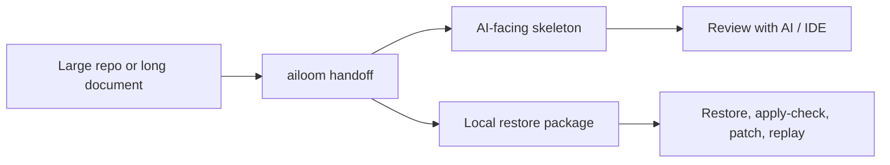

# Ailoom Context

<p align="center">
  <strong>Lossless context compression for AI coding, long documents, and large repositories.</strong>
</p>

<p align="center">
  Turn a heavy project into a compact AI-facing skeleton, while keeping the exact restore package local.
</p>

<p align="center">
  <code>local-first</code>
  <code>zero telemetry</code>
  <code>lossless restore</code>
  <code>patch/replay</code>
  <code>benchmark-ready</code>
</p>

Ailoom Context helps you hand large codebases or long manuscripts to an AI/IDE without dumping the whole source tree into context. It creates two coordinated artifacts:

- `AILOOM-SKL.v1`: a small structural skeleton you can share with AI tools.
- Restore package: an exact machine-readable package you keep locally for byte-safe restore, patching, and replay.



| What you get | Why it matters |
| --- | --- |
| Compact skeletons | Lower token pressure on large projects and long writing |
| Exact restore packages | Reconstruct text, files, directories, symlinks, and empty dirs |
| Local-only workflow | No cloud upload, telemetry, or background data collection |
| Patch and replay gates | Dry-run, policy-aware, and merge-aware update flows |
| Incremental handoff | Compress only the git-scoped change surface when you need speed |
| Benchmarks and diagnostics | See token savings, speed profile, warnings, and restore safety |

## Quickstart

Trying the beta with a real project? Start with [BETA_TRIAL_GUIDE.md](BETA_TRIAL_GUIDE.md), then send feedback with [FEEDBACK_TEMPLATE.md](FEEDBACK_TEMPLATE.md).

### macOS

From a cloned or downloaded checkout:

```bash
sh install.sh --setup-shell
ailoom demo
ailoom handoff
```

### Windows PowerShell

From a cloned or downloaded checkout:

```powershell
.\install.ps1 -SetupShell
ailoom doctor --install
ailoom demo
ailoom handoff
```

### The first real command

```bash
ailoom handoff --copy --open
```

`handoff` is the shortest "give this project to AI/IDE" command. It creates or reuses a restore-safe bundle for the current directory, writes an `AI_HANDOFF.md` prompt, separates the skeleton you can share from restore files you keep local, and prints the next command to copy.

| Command | Use it when |
| --- | --- |
| `ailoom demo` | You want a safe sample before touching your own project |
| `ailoom handoff` | You want the fastest project-to-AI handoff |
| `ailoom handoff --copy --open` | You want the handoff file opened and copied where possible |
| `ailoom quick` | You want explicit bundle, manifest, inspect, and restore paths |
| `ailoom recent` | You want to rediscover the latest bundle for this project |
| `ailoom doctor` | You want readiness, restore safety, and install diagnostics |

The human output for `quick`, `handoff`, `doctor`, and `recent` starts with an `At a glance` card so first-time users can immediately see status, restore safety, token savings, speed/freshness, and the next command to copy. `handoff` also includes a `Daily handoff` panel that says whether it created or reused a bundle, why, and whether the skeleton was copied automatically or needs the shown manual copy command. `quick` / `handoff` also write `AI_HANDOFF.md` and `handoff.json` beside the bundle, include a recommended AI/IDE prompt, separate the skeleton file to share from restore files to keep locally, explain the slowest visible phase, show a stable `Performance summary` plus detailed `Performance profile`, report default noise protection, suggest the best next command (`--fast` or `--reuse-if-fresh`) for large or slower runs, and explain why tiny projects may expand instead of saving tokens.

## What it does

- `context compress`: build one skeleton + restore package from text, file, or directory input
- `context inspect`: read one bundle without restoring the original source
- `context restore`: reconstruct the original text, file, or directory exactly
- `context apply-check`: check whether an edited candidate still matches the original skeleton boundary
- `context bundle`: export a reusable bundle with compression + inspect + optional apply-check artifacts
- `context patch`: export a patch bundle against the original context package
- `context patch-apply`: replay a patch bundle with dry-run, policy, and merge gates
- `context compress --incremental`: compress only the git change surface for a directory
- `context bundle --incremental`: export one incremental bundle instead of rebundling the full project
- `context patch` and `context patch-apply` on incremental bundles: keep replay scoped to the git change surface
- `context compress --focus-mode ...`: reshape the skeleton for symbols, imports, tree, or writing-outline views
- `context compress --skeleton-density ...`: keep the restore package exact while making large repo and long-text skeletons more selective
- `context compress --exclude ...` plus `.mcp-skeletonignore`: trim generated, dependency, cache, or build paths from directory and incremental bundles
- large directory skeletons now include grouped directory and extension overviews so omitted file-entry detail still keeps structural continuity
- large directory skeletons now prioritize hot subtrees for entry expansion and fold colder subtrees into compact overview blocks
- long-form text skeletons now emit folded chapter outlines so very long drafts keep narrative shape with a lower token budget

## v0.1 stability contract

The current `0.1.x` line is intended to be usable for early public workflows where exact restore matters more than a polished product shell.

Stable in `0.1.x`:

- compressing text, one file, or one directory into `AILOOM-SKL.v1` plus an exact restore package
- inspecting and restoring text, file, directory, and incremental directory bundles
- full directory restore reconstructs every file, symlink, and empty directory included in the restore package; by default directory compression skips common VCS, dependency, build, virtualenv, and cache directories such as `.git`, `node_modules`, `dist`, `build`, `.next`, `.venv`, `__pycache__`, and `.pytest_cache`
- non-UTF-8 and UTF-16/BOM text inputs keep original bytes for restore while using best-effort decode fallback for skeleton structure
- `apply-check` structural drift gates for text, files, directories, and incremental directory surfaces
- patch export and patch replay for text, files, directories, and incremental bundles
- dry-run replay reports, policy-aware replay, and merge-aware replay checks
- skeleton focus modes: `full`, `tree`, `imports`, `symbols`, `writing-outline`
- skeleton density modes: `adaptive`, `standard`, `compact`
- preset-specific skeleton strategies for `generic`, `codebase`, `writing`, `website`, and `ecommerce`
- benchmark reports for synthetic and repeatable repo-derived samples

Experimental in `0.1.x`:

- exact wording and ordering of `skeleton_text`
- scoring thresholds inside `apply-check`
- the adaptive budgeting heuristics for hot subtrees, folded chapters, and omitted entries
- benchmark timings across machines and tokenizer installations
- automatic encoding detection is best-effort when multiple legacy encodings can decode the same byte stream

Command exit behavior:

- exit `0`: command completed and validation gates passed
- exit `2`: invalid usage or invalid input contract
- exit `3`: validation warning, such as `apply-check` drift, policy block, or merge conflict block

When a command returns exit `3` with `--json`, the JSON payload is still the primary artifact to inspect.

## Why this is different from summarization

This project does not rely on lossy summarization alone.

Instead it separates context into:

- `skeleton_text`: the small, structured surface for AI tools
- `restore_package`: the exact machine-readable source required for lossless restore

That means we can reduce prompt weight without pretending the original source no longer exists.

## Install

macOS one-command local install from a cloned or downloaded checkout:

```bash
sh install.sh
```

This creates an isolated virtual environment under `~/.ailoom`, installs tokenizer-backed metrics, and links the `ailoom` command into `~/.local/bin`.
The installer finishes with a command check, PATH status, a first-run self-check, a copy/paste `handoff` command, explicit PATH recovery commands, and `~/.ailoom/install-readiness.json` so IDEs or automated test machines can confirm the install without parsing terminal text.

If you want the installer to add `~/.local/bin` to future zsh terminals for you, run:

```bash
sh install.sh --setup-shell
```

This appends one managed `ailoom PATH` block to `~/.zshrc`. It does not rewrite the rest of your shell profile; restart the terminal afterwards, or run the printed `export PATH=...` command for the current shell.

Windows PowerShell local install from a cloned or downloaded checkout:

```powershell
.\install.ps1 -SetupShell
```

This creates an isolated virtual environment under `%USERPROFILE%\.ailoom`, installs tokenizer-backed metrics through `.[context-metrics]` when available, writes `%USERPROFILE%\.ailoom\install-readiness.json`, and creates a local `ailoom.cmd` shim. `-SetupShell` appends one managed PATH block to your PowerShell profile; restart PowerShell afterwards, or run the printed temporary `$env:PATH = "...;$env:PATH"` command for the current session.

Check the installed command:

```bash
ailoom version
ailoom doctor --install
```

`ailoom version` reports install readiness, Python status, command availability, whether `handoff` is directly runnable from PATH, and the first `handoff` / `doctor` commands to run. If PATH is not ready, it prints both the persistent setup command and the temporary `export PATH=...` command. JSON output also includes `install_readiness_file` and `install_readiness_manifest` for IDE/plugin integration.
`ailoom doctor --install` is the first-run self-check: it reports Python support, command availability, installer readiness manifest status, the copy/paste repair command, and the first `handoff` command to run.

Current v1.0 readiness contract:

- `sh install.sh` should leave a usable `ailoom` command or print exact PATH recovery commands.
- `ailoom version --json` should expose machine-readable install readiness.
- `ailoom doctor --install --json` should expose machine-readable first-run install diagnostics.
- `ailoom handoff` should create or reuse a restore-safe skeleton bundle for the current directory without extra flags.
- `ailoom safety` should make the “share skeleton, keep restore package local” boundary explicit.
- `testing/release_readiness_check.py` is the release gate for smoke, quickstart, dogfood, doctor, benchmark, and installer readiness.

Update from a newer downloaded checkout:

```bash
sh install.sh --update
```

On Windows:

```powershell
.\install.ps1 -Update
```

Uninstall the managed command and virtual environment:

```bash
sh install.sh --uninstall
```

On Windows:

```powershell
.\install.ps1 -Uninstall
```

If `~/.local/bin` is not on your PATH, add:

```bash
export PATH="$HOME/.local/bin:$PATH"
```

Python package install:

```bash
python3 -m pip install .
```

Optional tokenizer-backed metrics:

```bash
python3 -m pip install '.[context-metrics]'
```

If you prefer not to use the Windows installer script, install directly with pip:

```powershell
py -3 -m pip install '.[context-metrics]'
ailoom doctor --install
```

## Quick start

Zero-learning project setup:

```bash
ailoom start
```

`context start` recommends a config, writes `.mcp-skeleton.json`, writes `mcp-skeleton-onboarding.md`, runs a restore-safety doctor check, and prints a copy/paste-ready command plus plain next steps. JSON output also includes `recommended_command_text` and `action_plan` for wrappers or test machines.
If you do not pass `--preset`, `--focus-mode`, or `--skeleton-density`, Ailoom Context now chooses practical defaults from the input type: code directories use codebase/imports/adaptive, prose files use writing/writing-outline/adaptive, and explicit CLI/config choices still win.

One-command bundle creation:

Try Ailoom Context without preparing your own project first:

```bash
ailoom demo
```

`demo` creates a lightweight sample project, builds a safe bundle, verifies restore safety, shows token impact, and prints inspect/restore commands.

Shortest AI/IDE handoff for your project:

```bash
ailoom handoff
```

`handoff` is a top-level shortcut for the restore-safe quick workflow. It defaults to the current directory, creates `context_skeleton.mcp` for AI/IDE context, writes `AI_HANDOFF.md` with plain-language instructions, writes `handoff.json` for future IDE/plugin automation, and keeps `context_manifest.json` plus the restore package available for exact reconstruction.
Run the same command again during day-to-day work; when the project fingerprint is unchanged, Ailoom Context automatically reuses the previous fresh bundle instead of recompressing. The `Daily handoff` panel tells you whether this run created a fresh bundle or reused the last one, why that happened, and whether clipboard copy was automatic or manual.
The generated handoff guide includes a recommended prompt you can paste into Cursor, VS Code agents, Claude, ChatGPT, Codex, or similar tools along with `context_skeleton.mcp`.
`handoff.json` is the machine-readable contract for IDEs and wrappers: it exposes `handoff_status`, `share_with_ai`, `keep_local`, `safety_boundary`, inspect/restore/copy commands, and the recommended prompt.

To copy the skeleton and open the generated bundle folder, use:

```bash
ailoom handoff --copy --open
```

`--copy` uses `pbcopy` on macOS, `Set-Clipboard` on Windows PowerShell, and `xclip` on Linux when available. `--open` uses `open`, `Start-Process`, or `xdg-open` depending on the platform.

To force a new handoff bundle even when the previous one is fresh, use:

```bash
ailoom handoff --force-refresh
```

This refreshes the bundle and updates the recent-bundle record.

One-command bundle creation for your project:

```bash
ailoom quick
```

`context quick` runs the zero-friction setup, checks restore safety, writes a full bundle, and prints the bundle path plus inspect/restore commands. It also points out the exact `context_skeleton.mcp` file to give to an AI or IDE, the bundle folder to keep, and a platform-specific copy/paste command for locating the generated files.
The first screen includes a `Use this now` section with the skeleton file, estimated token savings, restore command, and inspect command.
It also prints performance advice with `fast / ok / slow` status and copy/paste `--fast` / `--reuse-if-fresh` commands when those paths improve the experience.
The JSON output also includes `performance_summary`, a stable field intended for IDE/plugin integrations and simple dashboards. It reports speed status, slowest measured phase, estimated source/skeleton tokens, estimated tokens saved, default noise-protection impact, and the recommended next command.
`performance_summary.speed_diagnostic` adds the user-facing reason a run may feel slow and the best next command, so wrappers do not need to parse the longer performance profile.

To preview the plan without writing a bundle:

```bash
ailoom quick --preview
```

`--preview` checks restore safety, estimates token savings, shows the planned bundle/manifest paths, prints performance advice, and gives the exact command to run for real.

To open the bundle folder automatically after creation:

```bash
ailoom quick --open
```

To copy the generated skeleton text directly to the platform clipboard:

```bash
ailoom quick --copy
```

To find the last quick bundle for the current project later:

```bash
ailoom recent
```

`recent` reads `.workspace_ail/recent_quick.json` and prints the last bundle path, skeleton file, manifest, restore package, bundle size, created time, recommended AI prompt, open command, clipboard command, inspect command, and restore command.
It also checks whether the project appears to have changed since the last quick bundle; if the bundle may be stale, it prints a copy/paste refresh command.
Use `ailoom recent --list` to list the known recent bundle record, and `ailoom recent --clean-stale --dry-run` to preview safe stale-bundle cleanup candidates without deleting anything.

For very large directories where you want the fastest safe bundle path, use:

```bash
ailoom quick --fast
```

`--fast` skips config recommendation/onboarding generation but still runs sandbox restore verification before creating the bundle.
Standard `quick` will also print a speed tip with a copy/paste `--fast` command when the input is large enough that the faster path is likely to feel better.

If you already created a quick bundle and want to explicitly avoid recompressing unchanged projects:

```bash
ailoom quick --reuse-if-fresh
```

When the previous bundle is still fresh, this reuses it immediately and prints the same handoff commands. `handoff` does this automatically by default; if the project changed or the bundle files are missing, Ailoom Context falls back to a normal quick run.

Generated Ailoom Context work artifacts under `.workspace_ail/` are skipped by default so repeated `context quick` or dogfood runs do not pollute later compression or benchmark results.

Explain a bundle in plain language:

```bash
ailoom explain \
  --package-file /absolute/path/to/context-bundle/context_manifest.json
```

`context explain` translates a bundle into “what this is”, “why it is useful”, and “what to do next”, including restore guidance. It is the fastest way to hand a bundle to another AI, IDE, or teammate without making them learn the manifest shape.

Check the safety boundary before sharing files or replaying patches:

```bash
ailoom safety
```

`context safety` explains the core contract in plain language: `context_skeleton.mcp` is the AI-facing file, restore packages preserve raw source bytes and should stay local by default, restore never overwrites your source tree unless you choose an output target, and patch replay should start with `--dry-run --write-dry-run-report`. JSON output exposes the same guarantees for IDEs and wrappers.

Ailoom Context is local-first: it does not upload source code, skeletons, restore packages, logs, or usage records to any Ailoom Context server, and it does not include telemetry or background log collection. AI-facing skeleton output is redacted for common secret shapes while restore packages remain byte-exact for local recovery. See [SECURITY.md](SECURITY.md) for the full safety model and project identity notes.

Clean local generated artifacts when you want to remove old handoff bundles:

```bash
ailoom clean --dry-run --all
ailoom clean --all
```
It also includes common questions and emergency recovery guidance for changed projects, lost manifests, and safe patch replay.

Compress a directory:

```bash
ailoom compress \
  --preset codebase \
  --input-dir ./cli \
  --exclude "__pycache__/" \
  --exclude "*.pyc" \
  --output-dir /absolute/path/to/context-bundle \
  --json
```

For speed and lower token noise, directory compression has default noise protection for common VCS, dependency, build, virtualenv, cache, test-result, restore-output, and package-metadata directories: `.git`, `node_modules`, `dist`, `build`, `coverage`, `.next`, `.nuxt`, `.venv`, `venv`, `.tox`, `.mypy_cache`, `.ruff_cache`, `.turbo`, `.cache`, `__pycache__`, `.pytest_cache`, `.workspace_ail`, `testing/results`, `test-results`, `mcp-skeleton-restore`, and `*.egg-info`. These skipped directories are reported in `source_summary.skipped_dirs` and explained in `compression_explanations`, including estimated skipped file and byte counts where they can be measured quickly.

If you intentionally need those directories, pass `--include-default-skips` or set `"include_default_skips": true` in `.mcp-skeleton.json`. This is useful for debugging generated output, but it can make compression slower and much larger on real projects.

For repeatable project-level filtering beyond those defaults, add a `.mcp-skeletonignore` file at the input directory root. Blank lines and `#` comments are ignored; simple relative paths and globs such as `logs/`, `*.map`, and `generated/*.json` are supported.

Compress the same directory with one symbols-focused skeleton:

```bash
ailoom compress \
  --preset codebase \
  --focus-mode symbols \
  --input-dir ./cli \
  --json
```

Presets do not change restore fidelity, but they do change the AI-facing skeleton strategy. For example, `codebase` spends more budget on imports, symbols, and code-heavy hot subtrees, while `writing` spends more budget on chapter folds, headings, and prose entries.

Compress a long book draft with a tighter skeleton budget:

```bash
ailoom compress \
  --preset writing \
  --skeleton-density compact \
  --text-file /absolute/path/to/book-draft.md \
  --json
```

Inspect it:

```bash
ailoom inspect \
  --package-file /absolute/path/to/context-bundle/context_manifest.json \
  --emit-summary
```

Restore it:

```bash
ailoom restore \
  --package-file /absolute/path/to/context-bundle/context_manifest.json \
  --output-dir /absolute/path/to/restore-root \
  --json
```

Create a patch bundle:

```bash
ailoom patch \
  --package-file /absolute/path/to/context-bundle/context_manifest.json \
  --input-dir /absolute/path/to/edited-project \
  --output-dir /absolute/path/to/context-patch \
  --json
```

Preview replay without writing files:

```bash
ailoom patch-apply \
  --patch-file /absolute/path/to/context-patch/patch_manifest.json \
  --source-package-file /absolute/path/to/context-bundle/context_manifest.json \
  --dry-run \
  --write-dry-run-report /absolute/path/to/dry-run-report.json \
  --output-dir /absolute/path/to/replayed-project \
  --json
```

Preview one incremental replay with incremental metadata in the dry-run report:

```bash
ailoom patch-apply \
  --patch-file /absolute/path/to/context-incremental-patch/patch_manifest.json \
  --source-package-file /absolute/path/to/context-incremental-bundle/context_manifest.json \
  --dry-run \
  --write-dry-run-report /absolute/path/to/incremental-dry-run-report.json \
  --output-dir /absolute/path/to/replayed-incremental-surface \
  --json
```

Compress only the git change surface:

```bash
ailoom compress \
  --input-dir ./cli \
  --incremental \
  --base-commit HEAD~1 \
  --output-dir /absolute/path/to/context-incremental-bundle \
  --json
```

If an incremental bundle reports zero changed, added, and removed paths, inspect `incremental_diagnostics`. A clean git working tree, a path outside the changed scope, ignored files, or filters from `.mcp-skeletonignore` / `--exclude` can all legitimately produce an empty incremental surface.

Incremental restore intentionally reconstructs only that git change surface plus an `.ail_incremental_manifest.json` removed-path manifest. Use a non-incremental directory bundle when you need a complete project-tree restore.

Safe dogfood workflow for active development:

```bash
python3 testing/dogfood_self_check.py
bash testing/dogfood_self_check.sh
```

The dogfood self-check recommends an ignored `.mcp-skeleton.json`, writes an onboarding report, validates the config, trial-runs the recommended compression argv, compresses this repository, inspects the bundle, restores into `testing/results/dogfood-self-check/restore`, and verifies restored file hashes against the included source files. Keep dogfood restore and replay outputs outside the source tree or under ignored result directories. Prefer `patch-apply --dry-run --write-dry-run-report ...` until the replay surface has been inspected.

Readiness doctor for one source:

```bash
ailoom doctor --preset codebase --json
ailoom doctor --preset codebase --write-report mcp-skeleton-readiness.md --json
```

`context doctor` resolves config defaults, runs compression analysis, emits warnings/recommendations/explanations, restores into a temporary sandbox, and verifies the restored files against the original included hashes. It reports `readiness_status` as `ready`, `watch`, or `blocked`, plus `recommended_command_text` and `action_plan` so users know exactly what to do next.

If something goes wrong:

```bash
ailoom quick --input-dir ./missing --json
```

Error JSON includes `recovery_steps` and, when Ailoom Context can suggest one safely, `fix_command_text`. Human-readable errors print the same recovery hints. `context quick` also refuses to write into a non-empty `--output-dir`, so an existing bundle is not overwritten by accident.

Validate one edited incremental surface:

```bash
ailoom apply-check \
  --package-file /absolute/path/to/context-incremental-bundle/context_manifest.json \
  --input-dir /absolute/path/to/edited-incremental-surface \
  --json
```

Extract one writing-outline skeleton from long-form text:

```bash
ailoom compress \
  --preset writing \
  --focus-mode writing-outline \
  --text-file /absolute/path/to/book-draft.md \
  --emit-skeleton
```

Replay one edited incremental surface:

```bash
ailoom patch-apply \
  --patch-file /absolute/path/to/context-incremental-patch/patch_manifest.json \
  --source-package-file /absolute/path/to/context-incremental-bundle/context_manifest.json \
  --output-dir /absolute/path/to/replayed-incremental-surface \
  --json
```

## Benchmarking

Quick benchmark:

```bash
python3 testing/context_scale_benchmark.py --quick
```

Named benchmark scale profiles:

```bash
python3 testing/context_scale_benchmark.py --scale-profile quick
python3 testing/context_scale_benchmark.py --scale-profile standard
python3 testing/context_scale_benchmark.py --scale-profile stress
```

Save a run as the next regression baseline:

```bash
python3 testing/context_scale_benchmark.py --scale-profile quick --save-baseline-json testing/results/context_scale_baseline.json
```

Cross-platform smoke checks, including Windows environments without Bash:

```bash
python3 testing/run_cli_checks.py
```

Quickstart drift check for the README install/demo/handoff/quick/reuse path:

```bash
python3 testing/quickstart_check.py
```

Release readiness check before tagging:

```bash
python3 testing/release_readiness_check.py
```

The release readiness JSON includes a top-level `executive_summary` with the quick answer: total passed/failed checks, smoke and quickstart counts, dogfood restore status, doctor readiness, benchmark health, restore coverage, and the next action.
The same summary includes `v1_beta_readiness`, which is the macOS beta gate for install path, handoff path, safety/smoke path, doctor path, and performance path. When it reports `ready`, the project is suitable for local macOS beta use before broader Windows compatibility regression.
The dogfood self-check JSON also includes `performance_record`, which captures the tool compressing this repository itself: elapsed time, bundle size, included file count, source/skeleton token estimates, estimated token savings, and whether restore remained byte-exact.

For repeatable test-machine prompts, stress benchmark commands, and result reporting templates, see [CROSS_PLATFORM_TESTING.md](CROSS_PLATFORM_TESTING.md).

This Python runner covers key text, writing-outline, text-density, directory, bundle, filtering, focus/density, directory symbols/aggregation, incremental, clean incremental diagnostics, apply-check drift, text and incremental patch manifests, incremental patch replay, patch/replay, merge-conflict, dry-run report, policy template/block, invalid-input, invalid-restore-path, and benchmark readiness paths.

`context compress --json` also emits `source_scale_profile`, `compression_warnings`, `compression_recommendations`, `recommended_config`, and `recommended_command_args` so users can spot token expansion, large-directory risk, missing filters, or low-savings configurations and switch to a better focus/density without changing restore fidelity. `recommended_command_args` is a machine-readable argv list that scripts can reuse for the next compression run.

Project defaults can live in `.mcp-skeleton.json`, `.mcp-skeleton.yaml`, or `.mcp-skeleton.yml` next to the input directory, or be passed explicitly with `--config`:

```json
{
  "preset": "codebase",
  "focus_mode": "imports",
  "skeleton_density": "adaptive",
  "exclude": ["node_modules/", "dist/", "*.map"]
}
```

CLI flags override config values, while config and CLI `--exclude` patterns are combined.

Generate or validate a config file from the CLI:

```bash
ailoom config init --json
ailoom init --output-file .mcp-skeleton.yaml --json
ailoom config --output-file .mcp-skeleton.json --json
ailoom config --validate --config .mcp-skeleton.json --json
```

The config command reports supported presets, focus modes, density modes, and resolved defaults, which makes mis-typed values fail early before a long compression run.

Ask Ailoom Context to recommend project defaults from a real input:

```bash
ailoom config --recommend --input-dir . --preset codebase --output-file .mcp-skeleton.json --json
```

Recommendation mode runs the same compression analysis used by `context compress`, then writes a reusable config with the suggested focus, density, and exclude patterns.
Its JSON output includes `recommended_command_args`, a machine-readable trial compression argv list using the recommended config.
Add `--output-report-file mcp-skeleton-onboarding.md` to write an audit-friendly Markdown report with the source scale profile, current-vs-recommended token estimate, recommended command args, warnings, and next steps.

Install a lightweight git pre-commit hook for local self-use:

```bash
ailoom install-hook --json
```

The hook validates `.mcp-skeleton.json/yaml/yml` if present and runs CLI syntax checks. It does not apply patches, replay changes, or modify source files.

Repo-scale benchmark:

```bash
python3 testing/context_scale_benchmark.py --directory ./cli --iterations 2
```

Realistic repo benchmark:

```bash
python3 testing/context_scale_benchmark.py \
  --directory ./cli \
  --real-directory . \
  --real-text-files README.md CONTEXT_COMPRESSION_PRINCIPLES_20260507.md CONTEXT_COMPRESSION_SPEC_20260428.md CHANGELOG.md
```

The benchmark compares:

- heuristic metrics
- auto metrics
- tokenizer-backed metrics when available
- full directory bundles vs incremental bundles
- focus-mode skeleton variants vs the default full skeleton
- skeleton-density variants for the default full skeleton
- synthetic monorepo-style package trees across full, tree, imports, and symbols focus modes
- large-directory recommendations that identify the lowest-token verified focus/density choice per backend and sample type
- long-text recommendations that identify the lowest-token verified focus/density choice for manuscript-scale inputs
- per-source recommendation diagnostics with candidate counts, savings percentage vs baseline, token-ratio span, and compression-time comparison
- release-readiness summaries that separate blocking restore failures from watch-level scale/token signals
- optional baseline JSON comparisons for non-blocking restore, token-ratio, and compression-time regression trends
- executive summaries for quick test-machine handoff of readiness, regression, restore, and recommended modes
- stdout executive summaries from the benchmark command so CI and test-machine logs carry the key result without opening report files
- stdout stress-handoff fields for scale profile, case count, monorepo fixture size, token-ratio guardrails, and best savings signals
- named benchmark scale profiles for quick smoke coverage, standard release checks, and stress test-machine runs
- configurable scale-health checks for restore verification, monorepo file floor, and large-directory token ratios
- scale-health guardrails for best verified monorepo and realistic-directory size ratio versus full+standard baselines
- synthetic fixtures vs realistic repo-scale directory/text corpora
- restore verification for both text and directory cases

Recent repeatable benchmark signals on this repository:

- realistic directory corpus: about `661704` source chars to `30903` skeleton chars, with restore verification passing
- realistic text corpus: about `39793` source chars to `3076` skeleton chars, with restore verification passing
- long synthetic manuscript: adaptive and compact chapter-fold skeletons reduced the standard skeleton footprint to about `44.8%`

## Documentation

- `/Users/carwynmac/Ailoom Context/CONTEXT_COMPRESSION_PRINCIPLES_20260507.md`
- `/Users/carwynmac/Ailoom Context/CONTEXT_COMPRESSION_SPEC_20260428.md`
- `/Users/carwynmac/Ailoom Context/CONTEXT_PATCH_POLICY_TEMPLATE_20260429.md`
- `/Users/carwynmac/Ailoom Context/CONTEXT_TEST_MATRIX_20260428.md`
- `/Users/carwynmac/Ailoom Context/CONTEXT_REPO_SCALE_PERFORMANCE_REPORT_20260429.md`
- `/Users/carwynmac/Ailoom Context/CONTEXT_TOKENIZER_REPO_SCALE_REPORT_20260429.md`
- `/Users/carwynmac/Ailoom Context/CONTEXT_INCREMENTAL_BENCHMARK_REPORT_20260508.md`
- `/Users/carwynmac/Ailoom Context/CONTEXT_FOCUS_BENCHMARK_REPORT_20260508.md`
- `/Users/carwynmac/Ailoom Context/CONTEXT_CROSS_PLATFORM_VALIDATION_REPORT_20260520.md`
- `/Users/carwynmac/Ailoom Context/CROSS_PLATFORM_TESTING.md`
- `/Users/carwynmac/Ailoom Context/RELEASE_CHECKLIST_0_1.md`

## Scope

This repository is intentionally focused on one line of work:

- lossless context compression
- exact restore
- structural review
- patch and replay workflows
- incremental context transport for large repositories

It does not include the broader website, ecommerce, personal-site, or writing-generation surfaces from the original private parent repository.
